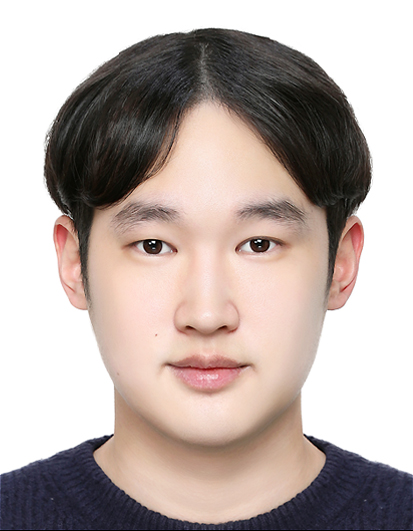

  

# 32200242 권민우

## 학력
`상현초등학교 졸업` 
`서원중학교 졸업` 
`풍덕고등학교 졸업` 
`단국대학교 정보통계학과 3학년 재학중`  

## 취득
`ADSP 취득` 
`TOEIC 920 취득`  

## 사용 가능한 프로그래밍 언어
`C언어` 
`R` 
`Python`  

## 원하는 진로
`데이터 사이언티스트` 
`데이터 엔지니어` 
`빅데이터 전문가`  

## 앞으로의 계획
`데이터를 이용한 공모전 적극 참여` 
`SQL, C++등의 프로그래밍 언어 습득` 
`Kaggle을 이용하여 데이터 이용하는 능력 향상`  

## 가고싶은 회사

 